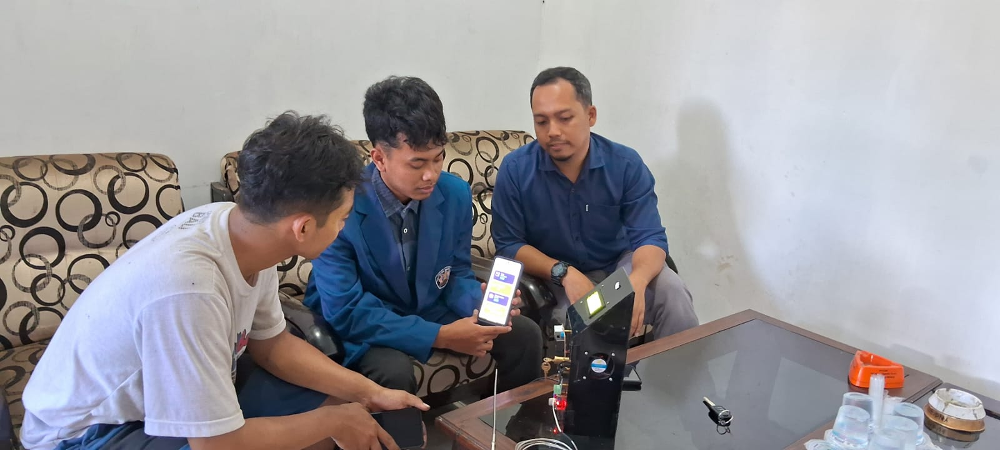
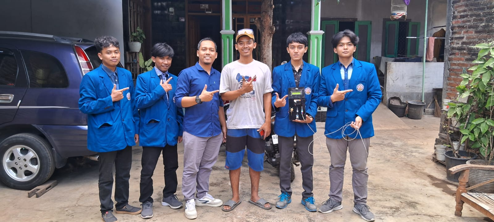

# Monitoring Pande Besi

Aplikasi **Monitoring Pande Besi** adalah solusi canggih yang dirancang untuk memantau berbagai parameter penting di industri pembuatan pisau. Aplikasi ini memberikan informasi real-time tentang:

- **Asap**: Memantau tingkat asap untuk memastikan kepatuhan terhadap standar lingkungan dan kesehatan.
- **Kadar Debu**: Mengukur kadar debu di udara untuk menjaga kualitas lingkungan kerja.
- **Suhu Ruangan**: Mengontrol suhu di sekitar area produksi untuk menjaga kenyamanan dan keamanan.
- **Suhu Tungku**: Memantau suhu tungku untuk memastikan proses pengecoran berjalan dengan optimal.

Aplikasi ini dibangun dengan menggunakan **Flutter**, sebuah framework yang memungkinkan pengembangan aplikasi lintas platform dengan antarmuka pengguna yang menarik dan responsif. Kami bekerja sama dengan mitra di Tulungagung untuk implementasi dan integrasi solusi ini.

## Screenshot Aplikasi

Berikut adalah tampilan antarmuka aplikasi:

## Foto Dengan Mitra

